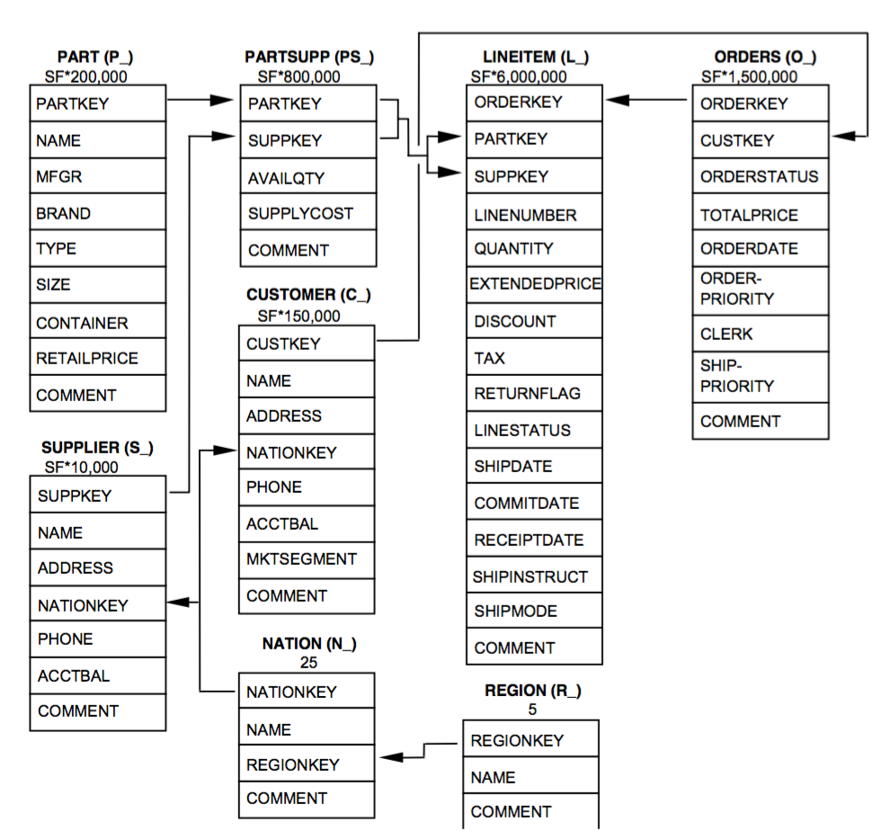

In this example, I will show how we can model a complete B2C data and perform more complex queries on it. I am going to use in this example the model used by the [TPC-H benchmark](http://www.tpc.org/tpch) which is shown below.

To model this schema using MongoDB, we can either use the denormalised model,the normalised model or a combination of both. To show the impact of data modelling in queries expressiveness, I have modelled the schema using all three models:

 - [a fully denormalised model](denormalised_model.md).
 - [a fully normalised model](normalized_model.md).
 - [a mix of normalised and denormalised models](mixed_model.md). 